# CHAPTER ONE - OVERVIEW

### INTRODUCTION

The East Boston Master Plan provides a framework for new growth and development in the community's commercial districts and waterfront area, while preserving and enhancing the quality of life in the community’s adjacent residential neighborhoods. Beginning in the 18305, when East Boston has developed as a residential neighborhood and commercial district, through the thriving economic period of shipbuilding and maritime industry and in the present period of major transportation and infrastructure development, East Boston has maintained a distinct physical and demographic identity. Immigrants to the region have Frequently settled in East Boston, drawn initially by employment Opportunities and proximity to the down, town and remaining because of the stock of affordable housing and the clear sense of community, among Other features. Today, the diversity created by this continuing immigration is one of the community’s greatest strengths.

East Boston, like other waterfront communities in New England, has been impacted by the severe decline in traditional water dependent industries. Despite that fact that the number of jobs related to these industries has declined over the decades, a strong community environment, improved rapid transit and vehicular connections to downtown Boston, and airport related economic opportunities work together to make the community a desirable place to live. And while East Boston's harbor front is today a substantially underutilized asset, it is a major component of Boston Harbor, supporting residential, recreational, tourism, and traditional port activities.

The East Boston Master Plan provides a means to take full advantage of these assets. No master plan is cast in stone; to be successful, a master plan must provide an overall vision while remaining flexible and responsive to unforeseen opportunities and changes in circumstances that may arise while the plan is carried out. The Master Plan represents the result of a broad-based Community process. It is the product of several years of goal-setting, the evaluation of alternative development scenarios, and a careful reviewing of alternatives for feasibility.

### This document is divided into four sections:

**Chapter One** provides an overview of the East Boston Master Plan.

**Chapter Two** presents a summary of the planning process and public involvement and describes current projects and planning efforts and provides a real estate market assessment.

**Chapter Three** presents the key elements of the Plan and describes recommended actions within each geographic area.

**Chapter Four** presents implementation recommendations.

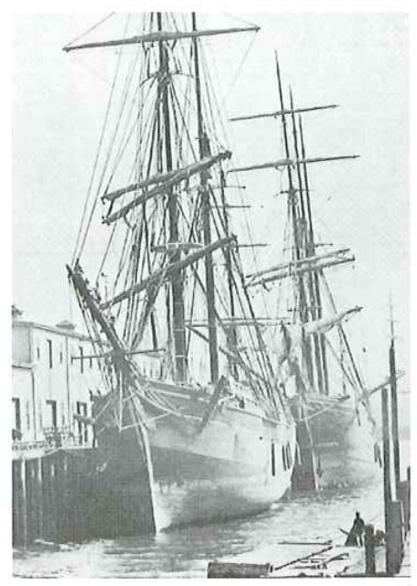

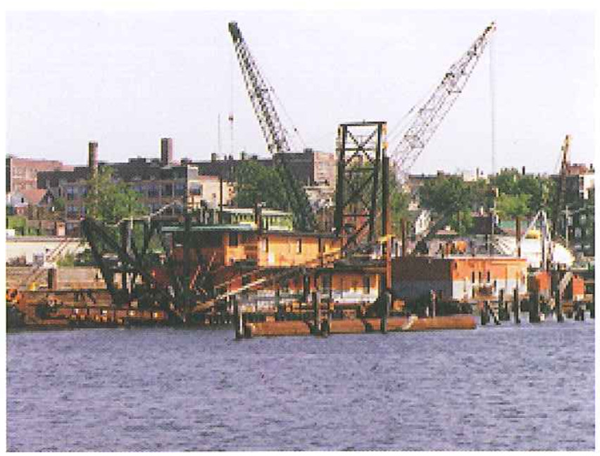

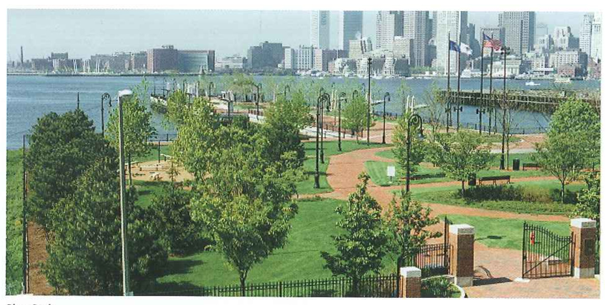

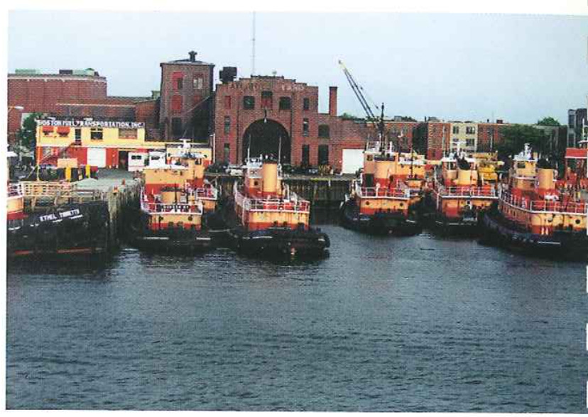

### THE VISION: A VIEW TO THE FUTURE

Piers Park demonstrates the pattern of development that should continue in the future. TO either side of the park, the anticipation of positive change will soon be fulfilled. Piers Park will be extended to land adjoining, the nearby Shipyard will be revitalized, and a new waterfront neighborhood of housing with inviting public uses and outdoor open space will soon be developed. Supported by the renewed activity on and around the waterfront, ferry service will again be running to downtown Boston.
The new East Boston Greenway will provide a unique linear open space, linking Piers Park and East Boston’s waterfront with several of the community’s neighborhoods and a restored Constitution Beach.

And nearby, in the local commercial districts and residential neighborhoods from Maverick Square to Orient Heights, orderly growth and change is taking hold.

The Master Plan describes planning for East Boston's waterfront and its maritime-related industries. It describes methods to protect and enhance existing residential neighborhoods, what role the community's history will play in Future development, and what new economic development opportunities exist along the harborfront and in the community’s various commercial districts. Descriptions of some of the key elements of the Plan are provided in this section. They are the building blocks of the Master Plan: urban design, transportation, open space, and economic development.

### A Revived Waterfront from Boston Harbor to Chelsea Creek

In the near future, residents and Visitors alike will be able to emerge from a new Maverick Station on the Blue Line and stroll down Lewis Mall with the skyline of the Financial District in full view. The handsomely paved and landscaped pedestrian way will be the "Main Street" of a new waterfront residential district, stretching from Piers Park to LoPresti Park. It will be lined with shops, cafes, and other public spaces 7 including community space and possibly a museum. At the foot of the Mall, at revived ferry service, supported by the new residents, and increased retail activity at the water's edge in East Boston, will once again link the neighborhood with the Financial District and downtown.

Within East Boston, access to and around the waterfront also Will be enhanced. The East Boston Greenway will link the community’s neighborhoods From Piers Park to Constitution Beach. The series of streets that run along the waterfront, from Marginal Street at Piers Park to Condor Street along Chelsea Creek, are physically linked with a new public way through Clippership Wharf, and visually connected through a common streetscape treatment as East Boston's 'Waterfront Way." Chelsea Creek and its waterfront, still an active industrial area, are being cleaned and improved. The Condor Street Urban Wilds site is being transformed into another neighborhood park, joined by a 1,200 foot segment of Harborwalk along the Creek to an observation point at the bulkhead line of the former Hess Oil site.

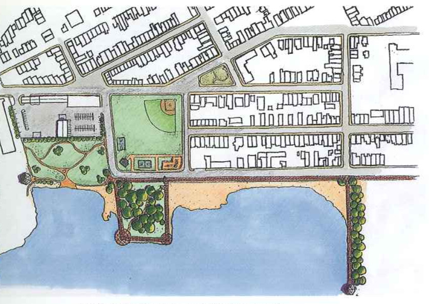

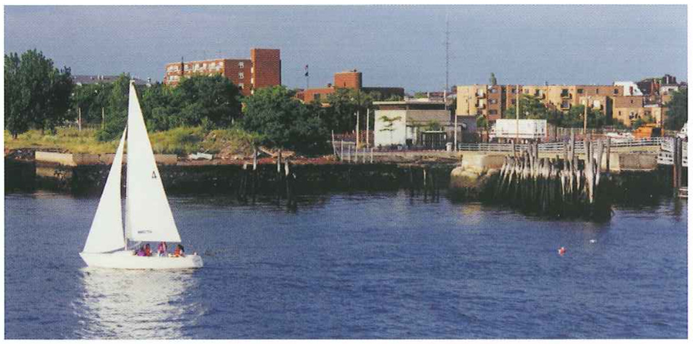

### Vibrant Business Districts

As new economic development begins to transform the East Boston waterfront, East Boston’s current and new residents will see benefits in the community’s neighborhood commercial centers as well. The success of the Main Streets program for both Maverick and Central Squares in improving the appearance and vitality of East Boston’s main business districts can be expanded to Orient Heights and Day Square. Streetscape improvements in each square will simplify traffic patterns, remove excess asphalt and increase pedestrian space. In Central Square, modifications to Liberty Plaza Will also provide batter pedestrian connections, both to the sweet and to the waterfront, which today lies hidden and inaccessible immediately behind. At Maverick Square, the reconstruction of the Blue Line station will also create a more pedestrian-friendly environment, with streetscape enhancements and widened sidewalks that will provide space for outdoor cafes.

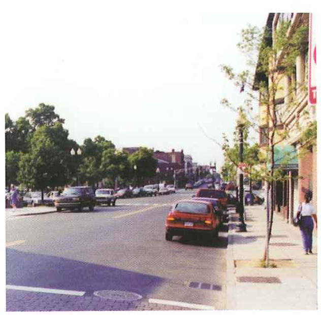

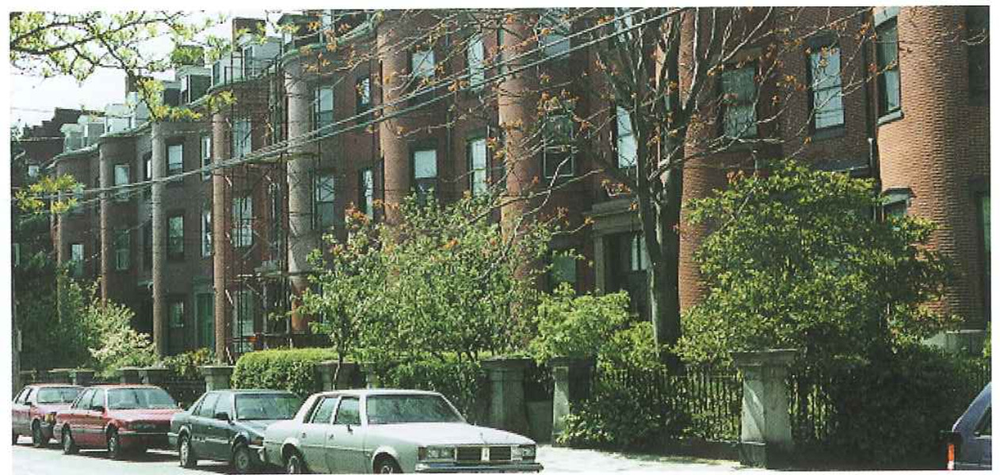

### A Unique Network of Open Spaces and Historic Resources

East Boston has historically suffered from insufficient open space, and loss of Wood Island Park to airport expansion is a painful memory for Iong-time residents. However, in the: next few years the increase in the amount and variety of high-quality open space available to East Boston residents, especially along the waterfront, will be even more dramatic than the amount of new building construction. Piers Park II and the likely park development of Massport's Pier 5 Will more than double the size of the current 6.5 acre Piers Park. Along Chelsea Creek, the improvement of the Condor

Street Urban Wilds will add another waterfront park setting for Eagle Hill residents who can walk along the Creek on Condor Street and continue out to the bulkhead via a landscaped pedestrian walk on the former Hess Oil site. The new Bremen Street Park, restored and improved Memorial Stadium complex, and the East Boston Greenway provide additional amenities and recreational opportunities for both
community residents and visitors. The Metropolitan District Commission's restoration of Constitution Beach, including much improved access and facilities, and the nearby Belle Isle Marsh, provide an unmatched diversity of open space and recreational opportunities within an urban setting.

The history of East Boston will also come alive in and around this network of open spaces. A series of interpretive kiosks will be placed at intervals along the waterfront, as a component of an expanded Harborwalk A community room in the new East Boston Sailing Center at Piers Park II will provide waterfront meeting space and an opportunity for educational programs for schools. In addition, a series of decorative gateways, designed with community input and erected with a grant From the Robert ingersoll Browne Fund. will help to establish a unique sense of place at each
location.

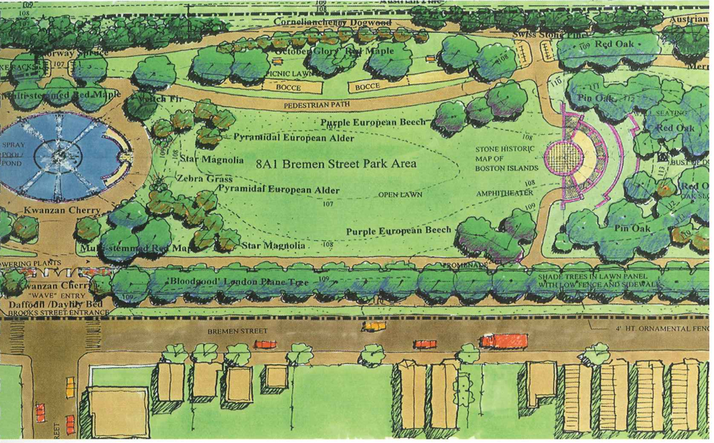

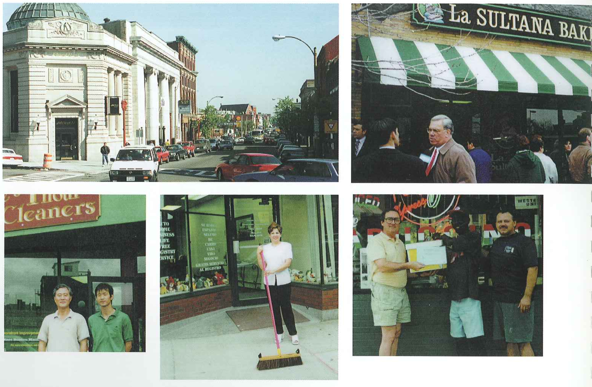

### Diverse Neighborhoods

While new housing and open space development is occurring around the perimeter of the community, East Boston's core 7 its varied and close-knit residential neighborhoods will be protected from unwanted development impacts and enhanced through small-scale, community-sensitive treatments. Market studies indicate that demand for homeownership and rental housing opportunities; in East Boston is high. Fortunately, opportunities for infill housing development to respond to this demand can be found throughout the c0m~ munity. Other sites might be devoted to vest-pocket Off-street resident parking lots or community gardens. The triangular mixed use neighborhood bounded by Central and Maverick Squares and the waterfront presents a special opportunity for a combination of infill and larger scale development. The City owned Boston East site on the waterfront could be an attractive location for potential artist live-work space similar to the existing community along the Fort Point Channel. Traffic calming measures will help to ensure that the quiet residential side streets of the community stay that way. With the neighborhood parking crunch eased by off-street locations, some of the unique triangular intersections on Eagle Hill may be freed of their use as parking lots and converted into neighborhood
greens.

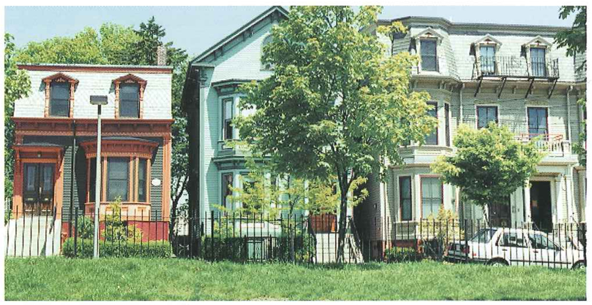

In summary, the East Boston Master Plan provides:

* **A Vision** for East Boston's waterfront, commercial districts, open spaces, transportation corridors, and neighborhoods that is supported by the community and public agencies, including local community organizations and city and state agencies.
* **A vehicle** to attract and guide private sector involvement -- including CDC and neighborhood associations W in key projects in the community, including housing revitalization and other development in neighborhood commercial districts and on the waterfront.

Implementation of the Master Plan can begin immediately as it has been accepted by key parties. The Plan identifies projects that can be accomplished in the short term, as well as establishes mid- and long-range priorities that will require further planning, design, and development.

The Master Plan is being finished at a time when resources and opportunities are available to resolve longstanding issues in revitalizing East Boston and to realize a well planned, community-based vision for East Boston.

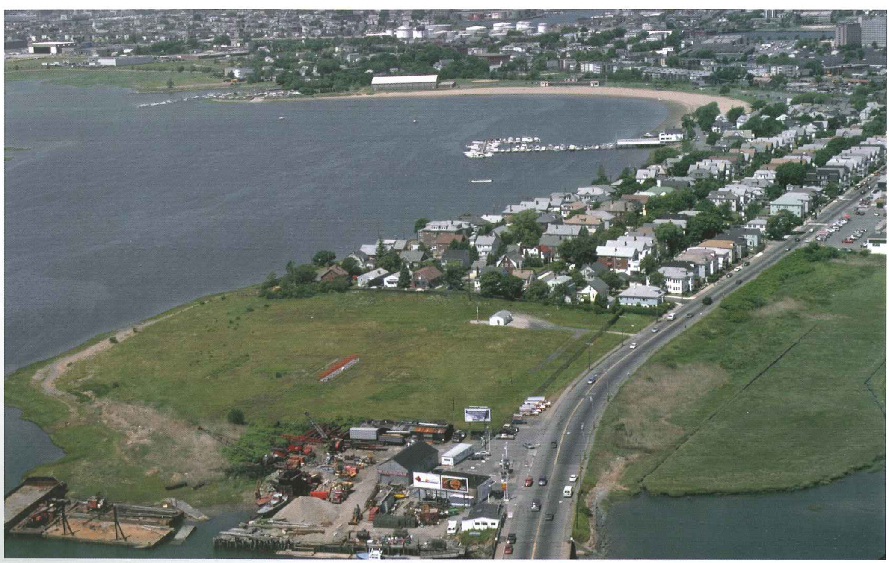

