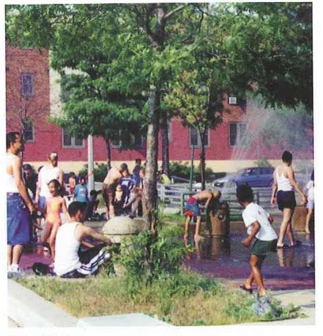
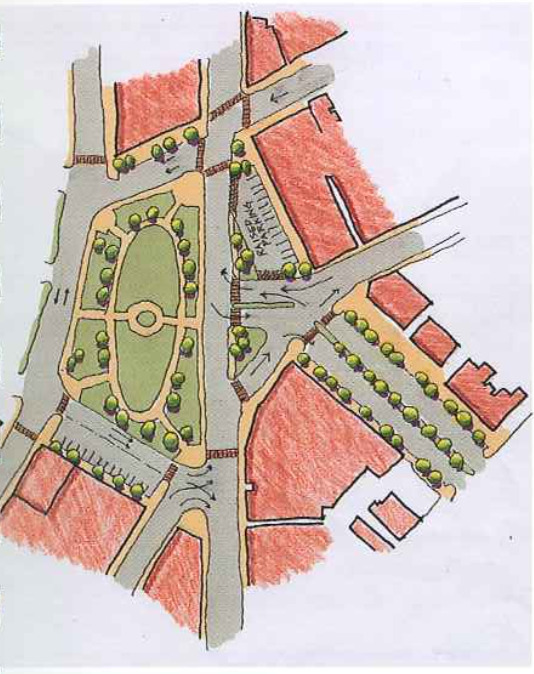
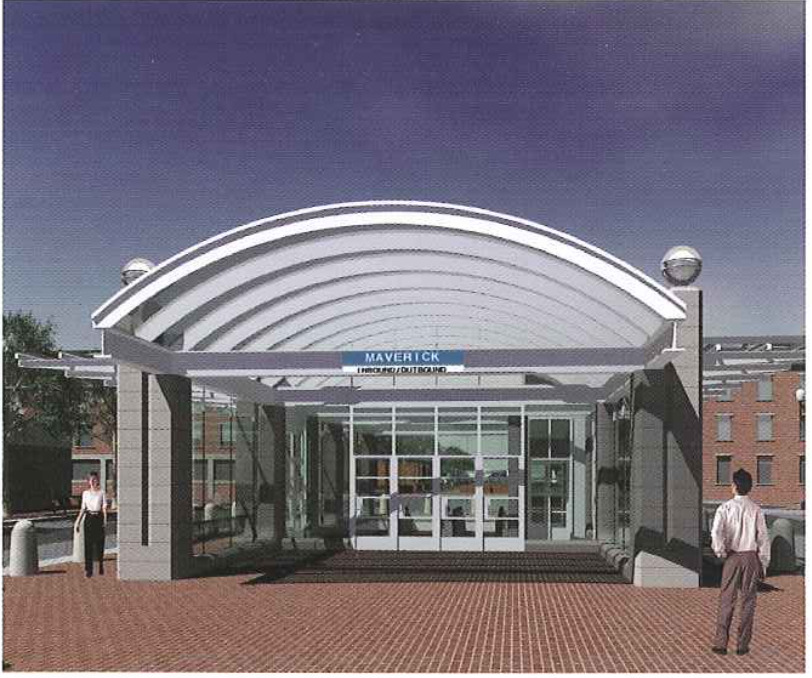
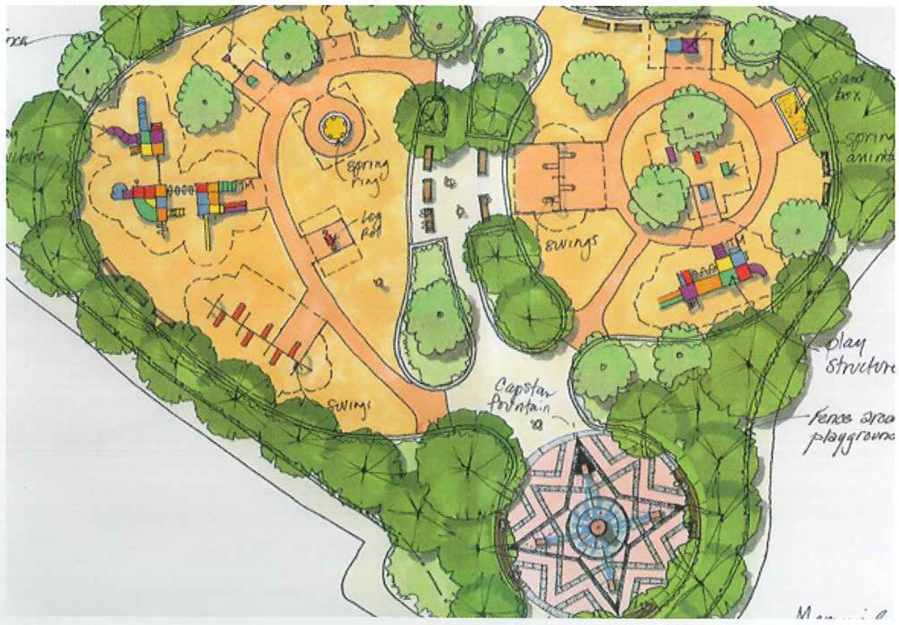
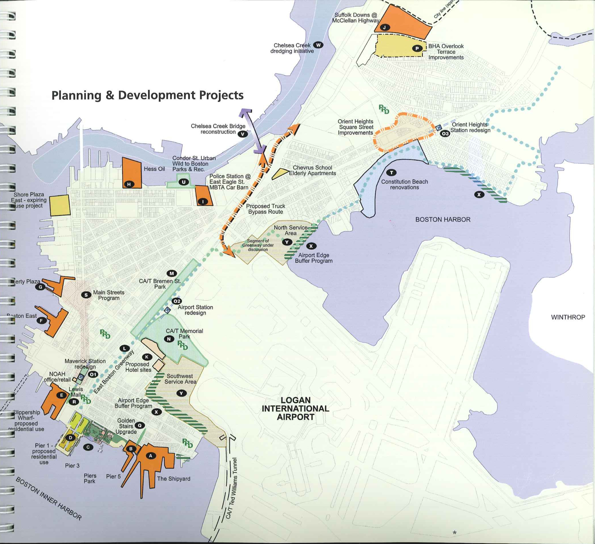
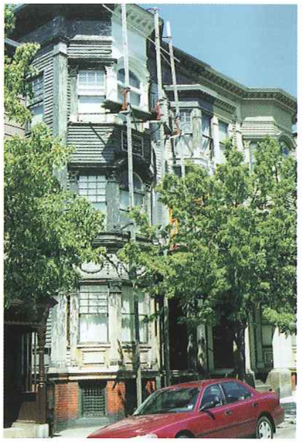
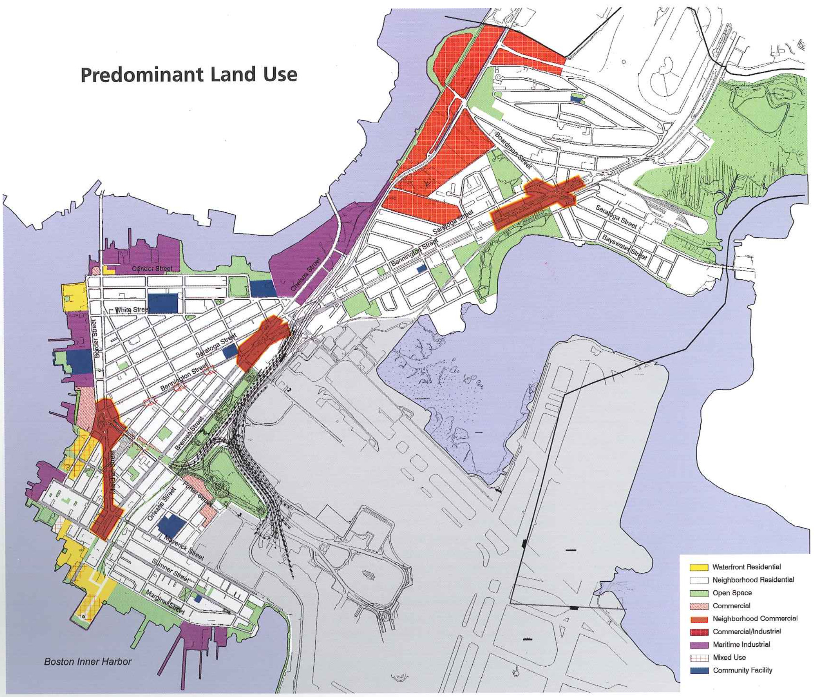

# CHAPTER TWO - PLANNING FRAMEWORK

### The Planning Process

The Boston Redevelopment Authority (ERA) and the eommunity-based Planning Coordinating Group (PCG), building upon the process initiated by the Comprehensive Hamming Initiative (CPD, have worked together over the past year to develop the East Boston Master Plan. The PCG is an 18-11mmber group representing diverse organizations in East Boston. Its monthly meetr ings, which have been open to the pub; lie, have been well attended by members of the community.

The PCG has reviewed and discussed each key step in the development of the Master Plan:

**Existing Conditions**  - land use, transportation systems, and economic market analyses.

**Planning Areas** 7 key Characteristics to create a framework for planning analysis.

**Focus Issues** 7 topics of concern to be addressed by the Master Plan.

**Goals and Evaluation Criteria** - framework for developing the Master Plan.

**Planning Alternatives and Strategies** _ three different approaches to the Master Plan.

**Preferred Alternative** 7 recommended approach based on community ideas and opinions.

Three workshops and two community meetings provided the opportunity for public input at each major decision point in the deve1opment of the Master Plan. Attendance ranged between 75 to 100 people at the following meetings and workshops:

**Kick-Of-f Meeting**, June 30, 1998 to describe the planning process and introduce BRA staff and its team. Participants were also asked to share their thoughts on issues of concern through a survey form.

**Issues/Opportunities** in Warming Areas Workshop, October 14, 1998 was pre ceded by a neighborhood bus tour and followed by the workshop at Which participants discussed critical issues for the Waterfront, Business District/Gateways, and Neighborhoods and Connectors planning areas.
**Alternatives Workshop**, December 9, 1998 at which participants were asked to indicate strengths and weaknesses of the three alternatives presented.

**Alternatives Evaluation Workshop**, March 10, 1999 presented the preferred alternative evaluation and recommendations. The participants were asked to provide opinions about the waterfront sub-option choices and to indicate pT'Ile otities for the waterfront, neighborhood and transportation, and economic deve1opmer1t eiements.

**Draft Master Plan Public Meeting**, May 26, 1999 to review the draft Master Plan with the community and provide an opportunity for comments before finalizing the Plan.

**Public Outreach** 7 Each workshop involved community-wide distribution of a bilingual (English and Spanish) BRA bulletin describing the outcome of the previous workshop and purpose of the upcoming workshop and other pertinent information. Workshops were well publicized with notices and radio announcements in English and Spanish.

Throughout the process, the BRA met with elected ofiicials, individuals, businesses, and other interested parties for briefing and discussion purposes. A focus group discussion on neighbor; hood commercial centers was he1d with individuais representing business, residential, and ethnic community interests to test ideas about the retail and come mercial opportunities of the centers.

Technical Memoranda and workshop materials were made avai1ab1e for review at East Boston libraries and the Harborside Community Center and on the Internet in order to afford individuals additiona1 opportunity to study the information and provide comments to the BRA. The large attendance at the PCS meetings and the workshops demonstrated the eomrnunitfs interest and involvement in the planning process and provided extensive feedback on the Plan as it evolved.

**Coordination** The BRA coordinated the development of the Master Plan With key city and state agencies as well as sponsors of ongoing development projects, such as the Massport Piers and Clippership Wharf.

**Consensus** - The BRA worked toward consensus among the parties affected by the Master Plan. As individual projects are implemented, the City will continue to provide opportunities for community involvement and review. It is expected that the Master Plan Will be amended in the future to meet changing conditions.

### Goals of the plan

Through the planning process, a set of goals and objectives were created that reflect the community's desire to maintain East Bostorfs identity and culture While accomodating new and innovative land uses in the future. The Master Plan includes the following goals:

* **Provide for a full utilization of the East Boston Inner Harbor waterfront and Chelsea Creek corridor** for industrial, maritime, commercial, residential, and recreu ational use.
* **Support economic development in East Boston with a compatible mix of public and private projects** including housing, retail, offices, and open spaces, that will complement existing uses and enhance the community as a whole.
* **Reinforce the existing commercial and business centers** that serve the neighborheods and the community in general.
* **Improve access to and from the waterfront** for the neighborhoods and East Boston as a Whole.
* **Reconnect neighborhoods** through better access and better pedestrian pathways.
* **Diversify water and land transportation linkages** between East Boston and the surrounding come munities, including downtown Boston.
* **Preserve and maintain the character** 0f the historic residential neighborhoods and natu tal resources of the community.
* **Address overall access to and parking** problems in East Boston.
* **Reduce the negative impact of large transportation facilities** and initastructures, such as the airport, on the community.
* **Develop a network of open spaces** that would build upon existing resources and improve the quality of life in the neighborhoods of East Boston.
* **Develop Harborwalk** along all waterfront areas.
* **Increase the quantity and variety of employment opportunities** for residents of East Boston.

### Concurrent Planning Efforts

The East Boston Master Plan process has identified concurrent planning efforts "in the pipeline". The purpose of outlining the improvements currently planned is to understand the actions which will occur regardless of the: Master Plan. However, for projects early in their development process, the Master Plan provides recommendations reflecting public comments. The Master Plan attempts to use these current trends to guide development toward the goals of the community.
 This section will briefly describe the major planning efforts already underway a that affect the Master Plan and East Boston.

* A - **The Shipyard** will be repositioned to decrease its impacts on the adjacent community and to allow for pedestrian access through the faeilign
* B - **Pier 5** will be utilized for addiLional marina related development to complement the adjar cent 180 slip recreational manna.
* C - **A conceptual design for Piers Park Phase II** at Pier 3 illustrates a water fountain feature, expanded sailing activities, and active recreation areas.
* D - **A request for proposals for Pier 1** Will Offer a major redevelopment opportunity for one of the most desirable properties on the water? front.
* E - **Clippership Wharf** development proposal {adj} cent to the Massport Pier 1) has shown pref liminmy intentions of developing a mixed-use residential program on the site and ShGUld be a major component of waterfront development.
* F - **Boston East** is a vacant 4.8 acre parcel owned by the City. Seaport bond funding has been secured to clean up dilapidated piers and derelict piles at the site.
* G - **Liberty Plaza Waterfront** in Central Square is the proposed site of a new ferry dock. Passenger water transportaLion facilities cur retitly available in East Boston include active and inactive boarding docks as well as layover betthing and vessel repair locations.
* H - **Hess Oil site** has undergone soil testing which has identified a number of contaminants. The owners of the site, Hess Oil Corp, have presented their hndings to IJ'IE Chelsea Creek Action Group and Will continue to inform the community on Future redevelopment issues.
* I - **MBTA Car Barn** - The City has proposed a new police facility at the former META ear barn site on East Eagle Street. The project will include a new police statitm, a two-bay Emergency Medical Service (EMS) area, a public park and a police boat docking area. The City of Boston Public WorlG Department will have new administrative ofhces, a new vehicle storage garage and salt shed on the stte.
* J - **Suffolk Downs-McClellan Highway** corridor offers opportunities for development of new and expanded non-watet dependent industrial facilities.
* K - **Proposed Hotels** - Two hotel developments have been proposed at Cottage and Porter Streets. The two projects, currently undergoing BRA review, would create approximately 650 guest suitest
* L - **East Boston Greenway Phase I** implementation TEUSES the former Conrail tightuol'uway for a planned pedestti an/bikeway Connection Lhroughout East Boston. Phase I is funded with $850,000 and started in lite fall of 1999, and Will run 21 1/2 mile from Marginal to Porter Street.
* M - **CAIT Mitigation**: Bremen Street Park will replace the existing parking lot with a linear park, complementing the Greenway section running alongside the park
* N - **C/AT Mitigation: Memorial Stadium park improvements will reconnect Memorial Stadium and its adjacent land to the Cove Street neighborhood by rerouting the elevated Route I/Airport access roads further north, thus adding much-needed open space and physical access to the community.
* O - **MBTA Blue Line Modernization Program** involves improvements to the Maverick, Airport and Orient Heights T stations to accommodate six car Lmina
	* O1 - **MBTA Maverick Station** improvements will reconfigure Maverick Station to include a new heaclhouse and redesigned sidewalks LO beLter accommodate riderst pedestrians, buses. and other vehicles.
	* O2 - **MBTA Airport Station redesign** will move the station further north in conjunction With the CM mitigation projects, Bremen Street Park. and Memorial Stadium Park improvements.
	* O3 - **MBTA Orient Heights Station redesign** involves improvement; to the Orient Heighu: Station to improve streetscape and mime circula~ rion. including the relocation of the busway [mm Barnes Avenue to Benningttm Street in order to reduce impetus 0n abutters.
* P - **Overlook Terrace**, the BHA housing project in Orient Heights, will receive a $7 million major renovation which will include unit upgrades and site improvements.
* Q - **The Golden Stairs** within jelIties Point are being refurbished as part oiongoing open space improvements being conducted by Boston's Parks and Recreation Department.
* R - **Lewis Mall** proposed landscape improvements will alleviate pavement problems and enhance an area used for outdoor activity for the elderly residents of the Boston Housing Authority's Heritage Homes.
* 5 - **City of Boston Main Streets Program** (within the Mavenck and Central Square area) continues to promote businesses within East Boston through marketing, signage, antl physical improvements such as facade improvements.
* T - **MDC Constitution Beach** renovations will rent)vate the bath houses, parking and general landscaping to improve the already-unique beach environment.
* U - **Condor Street Urban Wilds** has been transfeTTed to the City of Boston Parks and Recreation Department which will begin Cleaning] of contaminants and develop a new 5vacre park 0n the site.
* V - **Chelsea Creek Bridge** reconstruction started in 1999 Will improve truck circulation in this heavy industrial area along the Chelsea Creek.
* W - **Chelsea Creek dredging** is scheduled to be complete in 2000 will enhance the capabilities of deep draft ship access by dredging the Creek all the way to Revere.
* X - **Massport's Airport Edge Buffer Program** projects include access from the Greenway for views of Wood lsland Marsh in the North Service area, beautification oi the shoreline along Bayswater Street, and better access and land, seeped screening outside the Southwest Service area.
* Y - **Masspurt North Service Area** , preliminary plans suggest the North Service area would be reserved for idtcheti/cateting and the Southwest Service area for car rental facilities.

### Past planning studies and documents have been taken into account when developing the East Boston Master Plan:

**Reconnect - An East Boston of the Future, 1989** establishes a framework for development possibilities at various areas in East Boston.

**Urban Design Study - Airport Edge, January 1993** is a starting point for discussion of compatible uses adjacent to Logan Airport and the East Boston community. Existing conditions, possible uses, and design options are the sections addressed in the design explon ration of six sites around the Airport.

**Orient Heights Station Area Circulation Study, November 1994** evaluates options and identifies the safest long term strategy for bus and passenger/parlcing circulate fion at the Orient Heights station.

**East Boston: Building Momen turn for Change, June 1995** summarizes a consensus building workshop that was conducted by architect Antonio DiMambro With participating East Boston community groups.

**Port of Boston - Economic Development Plan, March 1996**, investigates the various mar ket sectors that the Port of Boston
served in the past and Will serve in the Future.

**Results of the September 21, 1996 Community Planning Day** are listings Of comments from discussions held in small issue work groups regarding various important planning topics includ ing: economic development, housing, community safety, human services, education, open space, health, arts/eulture/heritage, and transportation.

**Chelsea Creek Study - Introduction, August 1997** serves as a starting point for discussion on how groups could work together to impact the environ mental issues surrounding the Chelsea Creek.

### MARKET ASSESSMENT

After examining baseline improvements in the first section of this chapter, this section, Market Assessment, will examine the feasibility of the planning framework given various market forces.

Economic growth is evident in Virtually every economic sector in East Boston. East Boston shows significant improvement in all sectors since the trough of the recession, as measured in sales, expenditures, employment, occupied square feet and available housing units. This improvement arises largely from East Boston's participation in an expanding regional economy; however, East Boston's share of the regional markets shows moderating declines or stability in almost all sectors. Without continued effort, East Boston's economic growth is vulnerable to regional competition (especially if there should be a general economic downturn). East Bostonis local economy is also small in size, Which creates a vulnerability to the fortunes of individual companies, prop; erty owners, and industries.

Significantly improving competitive positioning Will require implementation of major new public and private initiae tives. A lack of proactive effort would likely lead to a loss of market share and increased vulnerability to external market conditions. East Bostonls current and future market positioning relies to a great degree on its competitive strengths, Which include its proximity to downtown Boston and Logan International Airport, its wateifront location and facilities, its established businesses and institutions, its physical quality, and its relative affordability These factors can be used to stabilize and improve East Bostonls economic condition.

### Opportunities

Specific opportunities exist for East Boston to capture a larger share of the neighborhood retail, marine-services, industrial, residential, and hospitality markets. An expanded neighborhood retail market would include improved sales at existing facilities and new retail and restaurant development Within the existing commercial nodes. The matine-services market would include expanded water-side activities (commere eial and recreational dockage, water transportation, exeursion/chatter usage) and expanded landside supports (toilets/showers, boat repair, storage} retail, and restaurants). improved occupancy and utilization at existing marine industrial facilities and the development of new and expanded non-wateredepencb ent industrial facilities Within the McClellan Highway corridor would be included in industrial market expann sion. Renovations of existing residential properties, conversion of obsolete industrial/eommereial properties, and the development of new rental and ownership housing stock would be implemented for the residential market. New facilities otiented to the business traveler and tourism markets would be included in the hcspitality sector.

#### Constraints

Specific limitations will have to be overcome for East Boston to capture a larger share of the market. These limitations include issues relating to cost, regulations, transportation, and community involvement. One specific factor is the high cost of (re)development relative to real estate prices in East Boston (especially including land costs, waterside infrastructure costs, parking costs, and landside development premiums). Another economic issue is the high cost of converting/redeveloping existing uses to more productive uses. There are regulatory limitations/conditions for cere tain uses of the waterfront (especially non-watet dependent) and there is limited land available for new develop ment. Two additional market con" straints relate to the perceived inconvenience of vehicular access to clowntown Boston and the perceived difl'lculu ty of a community review process

#### Retail Sector

##### Economic Conditions

Growing regional buying power is anticipated over the next 5-10 years. This gTowth suggests an expanded demand for regiOH-serving retail services such as apparel, household goods, gifts, eating and drinking. East Boston resident expenditures are stable- to- grewing, suggesting modest growth for tradition al communitywserving retail (food, drugs, liquor, and sundries).
Substantial local sales capture in some merchandise eategon'es (eating and drinking, drugs/personal care, liquor, automotive, miscellaneous retail, building materials) indicate the importance of non-resident expenditures to market sales, while limited sales capture in others (foodeatshome, apparel, furniture) indicate potential untapped market opportunities. The area shows relatively low retail vacancy rates, but also a significant undersutilization of space (relatively low sales volumes/SF). There is positive Financial feasibility for rehabilii tation of existing retail property and for instill development in established retail districts, but there is limited financial feasibility for new free-stancling retail development 9f scale.

##### Competitive Advantages & Disadvantages

There are several competitive advane tages and disadvantages relating to growth in the retail sector fer East Boston. The area shows significant evir dence of entrepreneurial activity and investment. Existing retail space within the districts is well concentrated, with
each district having wellidefined. bound, aries and an identifiable retail theme or demand focus. There are also significant niche market opportunities for groups such as tourists, waterfront users, daytime employees, commuters, and neighborhood residents. Low leaSe rates, the presence of major demand generators (i.e. Logan Airport), and reai sonably good availability of public parking all contribute to potential for positive retail Opportunities in East Boston. Limitations in quality space options and land available for new development might hamper development, while cost sensitivity of the market may also hinder the feasibility of maj or rehabilitation and new construction activity.

#### Hospitality Sector

##### Economic Conditions

Growth is expected near term in all demand sectors of the hospitality indus try. it is especially strong in the uextended stay}, business traveler and teunsm sectors. However, the limited morn supply in East Boston currently results in the diversion of business and tourism demand to other locations. This is particularly treublesome given the economic potential lost When more affluent, longer-stay business users and visitors take their spending power out Of the neighborhood. Near term financial feasibility is positive for ilextenclecl stayu hotels oriented to cost conscious visitors (business and tourist) room-rate and product requirements, and is limited for new waterfront hotel develop ment.

##### Competitive Advantages & Disadvantages

There are several competitive advan[ages and disadvantages relating to growth in the hospitality sector for East Boston. The presence of major demand generators (e.g., Logan Airpert) add to significant niche market opportunities. There is also potential for relatively affordable pricing. However, there are limited sites with highway access, visibility, and/or presencegwhich would be key to the business market_and access to dewntown Boston is perceived to be difficult.

#### Office and R&D Sectors

##### Economic Conditions

There is a growing demand in both office and Research and Development (R&D) sectors in the region, but a shrinking market share for East Boston: which shows low vacancy rates and little or 110 recent new development in these sectors. However, competitive rates and positive near term financial feasibility for upper floor office space in existing commercial districts demonstrate positive near term financial feasii bility. Limited near term financial feasibility exism for new freestanding effices 01' R&D development, except for llhuills tosuitl' occupants.

##### Competitive Advantages & Disadvantages

There are several competitive advantages and disadvantages relating to gTowth in the Office and R&D sectors fer East Boston. Low lease rates, good public transportation, the presence of a major demand generator (Logan Airport) and niche market themes/attractiens such as waterfront, tourism, history, and architecture are all positive [actors in the areas development. However, Cost sensitivity of the market and developable land con straints may hinder the feasibility of major rehabilitation and new construction activity. There are limited sites with access/visibility from major highi ways and limited quality space options currently available for either office or R&D users. The shrinking market share is likely to continue unless active steps are taken to support exjsting businesses and to promote business retention and internal growth.

#### Industrial Sectors (Marine and Non-Marine)

##### Economic Conditions

There is a shrinking though stabilizing demand in city-wide industrial employment and a growing airport-related industn'al demand resulting from ecor nomic expansion and diminishing supply (3f space on airport property. Although airportirelated industrial vacancy rates are low, several new airport-related industrial facilities are in the planning stages. There is also a shrinking marine industrial demand.

however, the market is active for existing lower intensity maritime users {marine services, marine construction, boat repair; staging, storage, and layover berthing). There are high rates of existing underutilized marine industrial properties and no recent new man'ne industrial development. Without subsidy, a limited short and long term feasibility for new marine industrial development is projected. There is positive near term Emancial feasibility for new non-marine industrial development, and East Boston boasts competitive lease rates.

##### Competitive Advantages & Disadvantages

There are several competitive advann rages and disadvantages relating to growth in the industrial sectors for East Beaten. The presence 0f Legan Airport and niche market themes/attractions (airport proximity, deep water berthing, accessible Inner Harbor location) work tOwarcl growth in East Boston. The area boasts relatively low lease rates on the underutilized land with expensive waterside infrastructure needs. Elsewhere cost sensitivity of the marine industrial market hinders the feasibility of major rehabilitation and new cone struction activity. There are also limited site's with the access/visibility frem major highways needed for successful development of new non-marine industrial facilities.

#### Residential

##### Economic Conditions

In general, there are low vacancy rates in rental and limited inventory in forsale properties. LOW income house holds spend well over the 33% of income standard (routinely between 40% and 50%) on housing costs and have virtually no home ownership opportunities in the East Boston market Maderate income households have disproportionately few home ownership opportunities; the number of affordable ownership units is disproportionately low relative to the number of middle income households. Moderate income households appear to be reasonably well served by the existing rental stock.

Feasibility of moderately priced ownership and rental apartment; in the neighborhoods {non-waterfront) is positive, but feasibility of low priced ownership and rental apartments in the neighborhoods (non-waterfront) is only positive if subsidized. Upper income households appear to be reasonably well served by the ownership market but underserved in the rental markets; the number of higher priced units is disproportionately low relative to the number of upper income households. New (or rehabilitated) housing units tend to be affordable only to the upper income tiers of the market unless subsidized. The feasibility of new luxury waterfront rental housing development is positive but also especially sensitive to land acquisition pricing, parking costs, and Other development cost premiums. There is limited evidence to support the current feasibility for luxury ownership apartments on the waterfront, as the cost of development is likely to exceed current end-unit pricing potentials.

#####Competitive Advantages & Disadvantages

There are several competitive advantages and disadvantages relating to growth in the residential sector for East Boston. Pricing is relatively affordable and there exist niche market opportunities such as water views, history, architecture, and tax-credit eligibility potentials. However, access to the area is perceived to be difficult.

