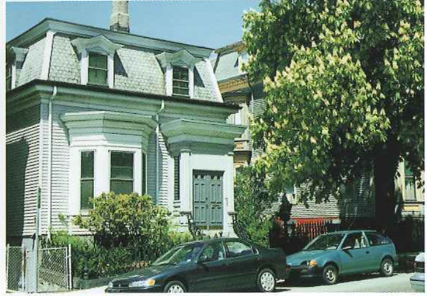
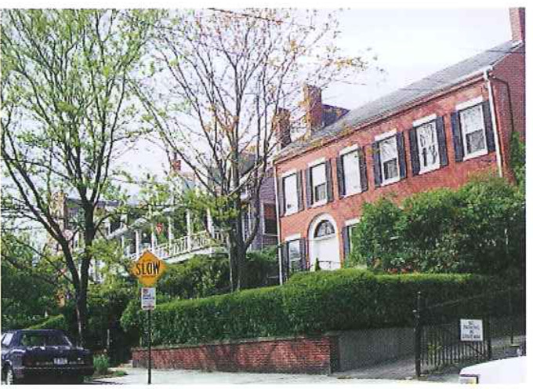

ebmp-22.txt

# CHAPTER THREE - THE PLAN FOR EAST BOSTON

The following chapter is divided into two sections. In the first section, the elements 0f the Planf the various planning considerations used to develop this Master Plan are described and there is a brief discussion of how the planning considerations apply to East Boston as a whole. In the second section, the planning considerations are applied to five ufocus areas and projects? with specific recommendations for each focus area that arise from applications of the planning considerations.

### 1.0 Elements of the Plan

The Master Plan has been influenced by East Bostotfs physical chatactetistics and the community's current organization. The most prominent physical features are the waterfront and neighbor" hoods, and the Master Plan proposes to build upon these two core features of East Boston.

### 1.1 Land Use

This term refers to location of core uses and activities including residential, commercial and business districts, and key new institutions (heritage, educa~ tion}.

**Residential use**  - East Bosten is a residential community and housing is likely to remain as the areais most significant component.
Development opportunities where housing should be pursued include:

* New waterfront housing.
* Continued inftll in the neighborhoods.
* Rehabilitation of existing older housing stock throughout East BC-StOI'l.
* Additional housing above commercial uses within commercial centers
* Reuse of vacant industtial/manufacturing buildings for residential uses, inckucling artistsa live/wcrk space.

Commercial and retail development There is strong community support for development of retail and commercial uses, and resulting employment oppot~ tunities for community residents. The Plan makes five specific recomendations:

1. Reinforce the existing business districts including Maverick Square, Central Square, Day Square, and Orient Heights Square.
2. Improve the physical environment and image of connections among neighborhood business districts by enhancing Bennington, Chelsea, Mehdian, and Satatoga Streets.
3. Promote entrepreneurial commercial develop ment by local residents.
4. Facilitate new commercial/industrial develop ment along McClellan Highway.
5. Integrate commercial and mixed-use activities Within larger waterfront development or reden velopment sites such as Liberty Plaza, Pier 1, and Clippership Wharf.

**Institutional use and facilities**, East Boston institutienal and educational services aid the residents and these uses should be supported by:

* **Upgrading** and expanding city facilities such as the Umana Barnes School and the prof posed police station on the former Car Barn site, and including the school playground ini tiative.
* **Reinforcing** cultural institutions by creating a heritage venue in conjunction with water? front redevelopment and a heritage trail to link existing cultural reseurces within the community.

**Maritime and industrial use** - Maritime and industrial activities have played an important role in the history and development of East Boston. These activities are located primarily along the Inner Harbor waterfront and Chelsea Creek. Some maritimeerelated activities are in decline, as illustrated by the closing of the Hess Oil 'liank site; other maritime service industries such as towboats are still in demand. To promote and maintain the maritime uses, recommenda tions include:

* **Maintain** existing viable maritime activities and regroup compatible activities together when feasible. such as in the case of the Masspott initiative.
* **Market** East Boston as the center fat port
services for the Harbor.

### 1.2 Open Space and Public Environment

Special attention has been given to open space and the pedestn'an environ ment, as the East Boston community has historically suffered from a lack of open space and inadequate pedestrian access to existing Open space and the waterfront. Creation and reinforcement of Open spaces include attention to the waterfront Open space and Harborwalk, neighborhood open space, streetscape and boulevards, and the Greenway, a network of new or existing adjacent open spaces.

**Harborwalk** , The creation of pedestrian walkways along the waterfront and expansion of the existing Boston Harborwalk system in East Boston is proposed. Harborwalk is an important element of downtown Bostons water front, of Which the East Bosten waterfront should be a Vital component. Principles which should be used in shaping the East Boston waterfront include:

* Designated Harborwalk areas to establish a Viable and attractive waterfront public pathway, with consistent and appropriate signage.
* Encouragement of publie/private partnerships to provide additional amenities along the Harborwalk.

**Waterfront open spaces** - Expansion of the waterfront open space network along the Inner Harbor and Chelsea Creek is proposed. These open spaces could be created as an expansion of existing major public spaces, as is planned for Piers Park Phase II at Pier 3. Other open spaces can be created where open land was reserved for this use, such as at the Condor Street Urban Wilds. In addition to this important open space, additional waterfront open spaces could be created as part of mixed-use developments.

**East Boston Greenway** - Several open spaces are planned as part of the Greenway, including:

* The Conrail com'dor from Piers Park to Bremen Street Park: Phase 1 construction scheduled to begin in early summer OI 1999; Phase 1L construction scheduled for spring of 2000.
* Bremen Street Park: To be built during the latter phases of construction 0f the Central
Artety/Tunnel Project (CAfI).
* Memorial Park: To be rehabilitated during the latter phases of the CA/ 1'.
* Constitution Beaeh/Bath House Renovation Construction: Currently under construction, with completion scheduled for Apt112000 under MDC administration.
* Bayswatet Street landscaping/Ajtport Edge Buifer: Enhancements as part of the Airport Edge Buffer Program under Massport,
* BIFCO property: TransIetred to City of Boston Parks and Recreation Department for elean-up,this Site is located at the entry into the Belle Isle Marsh

**Other public space improvements**, Several open spaces have been designate ed for improvements by the Boston Parks and Recreation Department including Porzio Park, Noyes Playground and the Pan's Street Playground. Open spaces or plazas within commercial centers should also be improved. In addition, it is rec0m~ mended that a series of existing trianguu lar interseettons be improved and that upocket park" improvements be included while maintaining parking spaces, as the community desires or as opportunities arise.

**Streetscape Improvements** Major areas for streetseape improvements have been designated to reinforce the recommene dations 0f the Plan. These include:

* Boulevard improvements.
* Addition of new streets pelpendicular to the waterfront
* Improvement of existing waterfront streets with a consistent streetscape image, including special signage designating an "East Boston Waterhont Way?

### 1.3 Historic Resources & Heritage

Historic preservation is a key principle under the Plan. An extensive field survey was done by the Boston Landmarks Commission (BLC) in 1989/1990 which documents approximately 6,194 historic stmctures, with several districts recommended [01' local designation or for listing on the National Register of Historic Plaees. More recently, the Landmarks Commission has completed a survey of East Bostorfs industrial waterfront structures.

The BLC recommendations seek to pre serve and enhance the character of East Bostotfs waterfront and its neighborhoods. The newly-designated Eagle Hill National Register Historic District expands upon a recommendation in the 1989/90 BLC survey. Trinity House, the Donald McKay House, and 39 and 4-1 Princeton Street are designated Boston Landmarks.

Building upon the findings of the BLC survey the Master Plan recommends continued rehabilitation of historic structures and establishment of additional historic districts in neighborhoods and akmg the waterfront, consistent with the Boston Landmarks Commissionk historic surveys and hndings.

East Boston historic features should continue to be inventoried. Creation of a '1heritage11 type trail that links the waterfront and neighborhoods' historic resources throughout East Boston is strongly recommended.

### 1.4 Transportation & Parking

Transportation, parking, and access to other Boston neighborhoods are prominent elements of the quality of life, health, and stability of East Boston.
The transportation aspects of the Master Plan must address the needs of all users including pedestrians, ears, truck, buses, and rapid transit, as well as water transportation.

Recommendations include short-term traffiocalming measures and designated truck routes, and lang~term circulation hnprovements such as depression of the tunnel portals, improved parking, water and land public transportation, and designation and improvements of llGateways to East Boston". East Boston has sacrificed much of the continuity and amenity of its local vehicular and pedestrian circulation system to
regional transportation projects. In par ticular, Logan Airport, Route 1A, the Sumner and Callahan Tunnels and the new 122d Williams Tunnel have taken up land, generated truck and automobile traffic, and created physical barriers between neighborhoods and the waterfront. The transportation recommenda~ tions of the Master Plan seek to mitigate the negative impacts of these facilities by stressing pedestrian, transit, and water transportation improvements which provide alternatives to auto travel and restore connectivity between neighe borhoods and open spaces.

**Transportation Recomendaticms:**

**Enhance** Sumner Street, Marginal Street, New Street and Border Street in combination with new connecriens through the Clippership Wharf and Pier One development parcels to create a clearly identiliable
waterfront boulevard_a u\Natetfrnnt Why". The new street will serve as a connector between new residential communities and Central Square. "\Naterfront Wayl' could also be extended to Condor Street.

**Undertake** short-term ttalhc-eahn'mg measures to limit airportigenemted and highway by-pass traffic from using the Summer Tunnel access streets (London, Pan's and Gove), the Logan AitporI/Ted Williams Tunnel access streets Ueffr'tes, Mavenck and Sumner Streets), Day Square, Orient Heights Square, Saratoga and Bayswater Streets, and Condor Street.

**Improve** Ltaditlonal and new boulevards, especially Bennington Street from the Revere [own line to Central Square.

**Develop** special treatment at East Boston gateways to Revere, Chelsea and highway ramps to improve the public realm and identtly the neighborhood.

**Simplify** traffic circulation, facilitate bus movement, provide additional oH-street parke ing, and enhance pedestrian amenity and safety within business districts including Central Square, Day Square, Maven'ck Square and Orient Heights Square.

**Designate** and sign tmck routes and create a new bypass road from the Chelsea Street Bn'dge and Route 1A to Logan Airport.

**Increase** the range 0f water transportation options, with expansion capabilities once markets are Seveloped and ridership is established.
**Promote** long-term improvements such as the Urban Ring transit line and depression and relocation of the Sumner/Callahan tunr nel portals.

### 1.5 Development Guidance

Based on the market assessment, future economic development would occur within four areas: the waterfront along the Inner Harbor, the residential neighborhoods, the McClellan Highway and Chelsea Creek corridor, and the existing commercial business centers. The development guidance recommendations include:

**Buiiding** on East Boston's competitive strengths, including its prom'm'tty to dowry town Boston and Logan International Airport, its waterfront location and facilities, its existing businesses and institutions. its historic structures, and its relative
affordabiliqr.

**Enhancing** the existing residential character of East Boston neighborhoods.

**Preserving** view corridors, access, and appropriate scale of development along the waterfront

**Improving** the pedestrian expedence and amenities throughout the community.

**Ensuring** continued pubiic review of new developments.

**Promoting** the existing histmic district and other programs to reinforce urban design character of the historic neighborhoods and waterftonts.

### 1.6 Regulatory Environment

East Bostonis development must occur Within the framework of city, state and federal regulatory programs.

In 1993, Article 53 was adopted as part of the Baston Zoning Code and estab lished the East Boston Neighborhood District. Article 53 zoning is generally compatible With the Master Plan goals and elements. One exception is zoning for Bennington Street in the area of Orient Heights Square Where the Master Pkm recommends a change to Corridor Enhancement Sub-District in order to strengthen the boulevard character of Bennington Street.

The Boston Zoning Code contains set:[tons pertaining to waterfront develop ment and other special dism'cts. The regulations pertaining to the waterfront are the most critical to shaping East Bostorfs development future. Chapter 91 Waterways regulations preserve and protect the public rights to filled and Bowed tidelands for uses that are waterdependent or otherwise serve a public purpose, including those waterfront resources classified by the Massachusetts Coastal Zone Management (MCZM) program as Designated Port Areas (DPA). There are two DPAS in East Boston: the Chelsea Creek DPA Which includes a continuous strip of the land along the Chelsea Creek, and the East Boston DPA (Boston Inner Harbor waterfront) Which '13 made up of [our disconnected parcels.

When the City prepares its Municipal Harbor Plan for East Boston, it will be necessary to evaluate the DPAs in light of their suitability {0r maritime industrial use such as depth of water, character istics of land area adj acent to the wateru front, as well as land based transportation access and available utility service, and other important attributes necesr sary for commercial maritime uses. Consideration will need to be given to neighboring uses and the Master Plan reeemmendations as well as to the allocation of supporting commercial uses Within the MCZM regulatiods limit of 25% of total DPA land area.

The Master Plan is supportive of the goals of Chapter 91 and the MCZM [Designated Port Area regulations. Within this reguiatory environment, the Master Plan promotes additional Open space and access along the waterfront. 1t retains and respects the DPA goal of protecting maritime industrial resources With some modification.

### 2.0 Focus Areas and Projects

The Plan identifies specific geographic areas of East Boston where change is anticipated. Determination of how these places will develop will be key to the success and quality of life of the East Boston community as a Whole. The section is divided into five subsections, each dedicated to a particular sub-area or focus area.

Each focus area reflects planning analysis developed with the community dun ing the planning process. Each area is accompanied by a description of recommendatians in terms of the six elements of the plan, as applicable: land use, open space and public environment, historic preservation, transportation, development guidance, and regulatory environment.

**Reviving the East Boston Waterfront:** This focus area encompasses thejeffries Point/Massport waterfront, the Old East Boston waterh'ont, and the lower section of Chelsea Creek bordering Eagle Hilii

**Strengthening the Residential Neighborhoods** This focus area encompasses all residential neighborhoods including Jefh'ies Point, Eagle Hill, The Flats, Harborvicw, arid Orient Heights.

**Enhancing the Neighborhoods' Commercial Centers:** This focus area includes actions and policies recommended in all four major business centers: Maverick Square, Central Square, Day Square, and Orient Heights Square.

**Energizing the McClellan Highway - Upper Chelsea Creek Corridor:** The indusm'al waterfronL in East BosLon is primarily situaLed in the area along the Chelsea Creek and McClellan Highway. 1L is dominated by industrial and commercial uses that rely on the McClellan Highway forr immediaLe [ruck access, providing major opportunities for economic development in East Boston.

**Shoring up the Airport Edge:** This focus area includes the various parcels of property which surround Logan Airport. This focus area affects most neighborhoods in East Boston and has opportunities for majcr community open space benefits.

### 3.0 Reviving the East Boston Waterfront

East Bostorfs waterfront is a critical area of focus for the Master Plan. The area offers gTeat development potential, given its views of downtown Boston and Charlestown, its strategic location for maritime activities, and its rich histDIy. Existing and recently proposed development projects 011 the waterfront focus on the Harbor. The communitfs desire for increased open space and cu1~ tural activities must be balanced with the private sector market demand for waterfront residential use and the regional demand for port-related activitles.

Recommendations include regulatory and urban design guidelines intended to protect the public interest in, and access to, these valuable waterfront resources.

### 3.1 Land Use

**Recommendations:**

**Expand** the mix of uses on the waterfront to include additional residentialj retail/commereial and cultural uses coexisting with present marine industrial, residential and institutional
USES.

**Increase** the quality of residential use on the waterfront by building new housing on Pier 1. Clippership Wharf, Boston East and other waterfront properties that become available for redevelopment, while improving Shore Plaza East and other residential uses adjacent to the waterfront.

**Promote** potential retail and commercial uses at new development sites that complement abutting commercial and retail uses in Mavetick and Central Squares.

**Maintain** maritime use and maritime port services including those at the Shipyard, along the Inner Harbor waterfront and along Lower Chelsea Creek.

**Promote** culturaI/institut'tonal uses that reileet the heritage of the community. A eultural foundation should be formed and housed in a temporary facility as a first step toward the creation of a museum on the waterfront. The permanent museum could include exhibits that interpret East Bostonis history and development Summarized in feur
basic themes:

* American Revolution - Chelsea Creek was the site Dtvarious events in the war,
including the hrst naval battle of the war.
* Maritime , Shipping and porterelated buildings and spaces were significant in
the development of? the eemmunity.
* Immigration , The people who immigmted to East Boston have left a cultural and physical legacy that is still reflected in many structures
* Transportation - Logan Airport and other transportation facilities have played an important role in the physical development of East Boston.

### 3.2 Open Space & Public Environment

The waterfront oHers the best opportunity for the creation of new parks and open space within East Boston.

**Recommendations:**

**Create** additional waterfront parks along the Inner Harbor waterfront. Expanding Piers Park by creating additional waterfront park; at Piers 3 and 5 would create a major water from open space with spectacular views of Boston Harbor and downtown Boston. Programming for these two piers is currently at an early stage, but each park offers potene rial for active and passive recreation and would create a continuous landscaped public waterfront park along the Jeffries Point neighborhood.

**Develop** open spaces along the lower section of Chelsea Creek.  The Consdor Street Urban Wilds is being transferred to the City of Boston's Parks and Recreation Department, which plans to clean it and create a passive recreation park with restored vegetaoon and waterfront access.  An additional open space in the form of a pedestrian access corridor to the bulkhead line would be created on a portion of the vacant Hess Oil site and conneceted to the Urban Wilds by a 1,200 foot segment of Harborwalk along Chelsea Creek.  The site's redevelopment will necessitate a major clean up and might be constrained by its location within a Designated Port Area.  The abandoned railroad right-of-way at the norther end of East Boston's Chelsea Creek shoreline may present an additional open space opportunity.  

**Expand** Harborwalk to connect the waterfront open space system and public environment.  The existing East Boston Harborwalk, which runs from the Harborside Hyatt Hotel to Porzio Park, should be extended when new parks and new activities are developed on the waterfront.  Harborwalk would continue along Marginal Street's existing and new waterfront park system, threading its way around the proposed Pier 1 and Clippership Wharf developments and connected to LoPresti Park.  There are also opportunities to extend Harborwalk from LoPresti park to the Boston East site, the Liberty Plaza (where a small Harbor already exists), Umana Banes School and Shore Plaza East.  The route would then turn onto Condor Street along the Chelsea Creek, through the Hess Oil site and up to the proposed Urban Wilds Park.

**Create** waterfront pocket parks and public access.  In connection with future redeelopment at Pier 1, Clippership WharL Boston East, Hess Oil, and the Car Barn site, small pocket parks and public access rightiofrways would be an integral part of the site design.

**Upgrade** existing public waterfront open space Public spaces such as Porzio Park, LoPresti Park, and the Umana Barnes School property should be enhanced to be part of a cohesive waterfront open space network.

**Facilitate** public access and use of the water front. Privately owned waterfront properties where waterfront space is unused, such as Liberty Plaza, Shore Plaza East, and Hodge Boiler Works, present opportunities to C0117 tinue Harborwalk.

### 3.3 Historic Resources and Heritage

East Boston was initially planned to contain a mix of homes, maritime and other industries, and recreational facilities. By 1839, East Boston was already an important waterfront industrial center, with shipyards specializing in the construction of Clipper ships. East Easton's Wharves served as Bostorfs
center for grain exports to Europe as well as the Boston terminal for the Landon-based Cunard ship line. Waterfront structures and features reflective of this heritage still remain. The Boston Landmarks Commission recently undertook an inventory Of the Old East Boston waterfmnt and Lower Chelsea Creek waterfront and identified a number of significant structures. This existing industrial character of the waterfront is part of the quality of Me and unique character of East Boston.

**Recommendations:**

**Undertaking** projects designed to illustrate East Busteds rich history. These could range from historic markets and exhibit panels mounted along Harborwalk, to interpretive landscapes designed to be integrated into the waterfront park system, to a cultural waterfront facility such 35 a museum with community space and exhibits, modeled after the EMS North End
Historic Piers program.

**Establishing** historic districts to include the contiguous waterfront area where the density of historic man'tlme features and waterfront integrity is high.

**Adopting** historic waterfront guidelines that would not only protect signiftcant structures but would also ensure the contextual respect fulness of new development.

### 3.4 Transportation

Transportation recommendations are centered around strengthening pedestrian and vehicular circulation along, to, and [tom the water in conjunction With development or redevelopment of key parcels such as Pier 1 and Clippership Wharf

**Recommendations:**

**Designate** a continuous uWaterfront Way, with a signature streetscape treatment along existing streets and new sections created within and between the development parcels.

**Create** a continuous pedestrian system linking the Greenway [.0 I'Iarborwaik (including passage through the shipyard).
Provide additional landings for water transiportation services.

**Develop** a new Maverick Station headhouse closer to the water once development is completed at Clippetship Wharf.

Abutter access to development parcels 0n Bremen Street and Havre Street should be promoted to encourage use of these streets for traffic resulting from new development, and thereby reducing trafftc impacm on Orleans Street, Maverick Square, and Meridian Street. Higher residential densities should be planned in the areas closest to the Blue Line stations and water transportation landings; parking requiremens should be tailored to 3.1le for a lower ratio of spaces to dwelling units in areas closest to transit.

Detailed traffic impact studies need to be completed for each development site as part of the city and state environmental approval processes. But prelimi~ nary analysis of likely land uses and densities for the existing and new activities along the waterfront indicate that traffic can be accommodated without undue negative impacts on existing residential areas.

### 3.5 Land Transportation and Waterfront Access

**Recommendations:**

**Create** an additional street system to support vehicular access and traffic When dcvelOPing Recommendations: This section describes key develop larger waterfront parcels such as Pier 1 and Clippership Wharf.

**Integrate** a new street system while developing contiguous large parcels to allow for improved vehicular flow.

**Connect** a new street pattern to the existing East Boston street system to preserve public use of and access to the waterfront.

**Encourage** use of alternative routes to divert vehicles from the congested Maverick Square and Meridian Street.

**Develop** and maximize use of nonrauto modes of transportation including water shuttles, bicycles, Walking, buses, a waterfront trolley, and the Blue Line.

**Strengthen** pedestnan connections to the multiemoclal transportation center in Maverick Square. A new pedestrian entrance to the station on the waterside of Sumner Street should be created, and extra peak hour service should he added on the Blue Line to turn trains around at Maven'ck Square as development intensifies in this area. This will help insure that riders boarding at this station can be comfortably accommodated.

**Allow** on-street parking on new streets.

**Create** a connected pedestrian circulation system along Harhorwalk, the Greenway, and connecting streets and sidewalks.

**Upgrade** the existing waterlront street network [torn Marginal Street to Condor Street_designated East Bostonis "Wateii'ront Way: with a signature streerscape design.

### 3.6 Water Transportation and Access

**Recommendations:**

**Provide** water transportation facilities (such as public ferry terminals for scheduled services, water taxi/cultural loop, and charter use) at key sites along the waterfront including the expanded Logan South, existing Lewis Mall. and a new terminal at the Liberty Plaza/Central Square waterfront.

Commuter shuttle services with associated landside improvements to facilitate access and passenger dropeoIE/pickeup may be added from Lewis Mall and Liberty Plaza Once an adequate volume of ridership is established. At present, demand levels are too low to make such services and improvements.

**Create** additional space for public landings for small vessels at ferry terminals.

**Develop** clocks and landings for water taxis and small boats at seveml exisLing and new locations. Existing Clocks with low free" boards are located at Boston Marine Shipyard and at the Piers Park sailing center. Additional sites may be added as part of new development at Clippership Wharf, Boston East site, and at the META Car Barn site on Chelsea Creek Such docks would provide a touch-and-go landings for smaller private and ment Site guidelines for the Masspott Piers, Boston East, Liberty Plaza, Hess Oil, and overall waterfront development guidance.
commercial vessels.

**Allow** space for vessel support services (parriculai'ly ship repair and maintenance service es) and layover berthing along the waterfront at a variety of East Boston pier sites would add incrementally to the East Boston economy by providing maritime employment.

### 3.7 Development Guidance

This section describes key development site guidelnes for the Massport Piers, Boston East, Liberty Plaza, Hess Oil and overall waterfront development guidance.

**Recommendations:**

**Maintain** view corridors to the water along Marginal Street, Clippership Lane, Lewis Mall, Bremen and Orleans Streets, and the Greenway.

**Maximize** views by designating Harborwalk to be barrier-free, limiting fences only for safety reasons, and creating structures and shelters which are transparent and screenlike.

**Develop** unified and unique lighting and sigr nage consistent with l-iarborwalk and water Front street frontage which celebrate East Boston's waterltont heritage.

**Create** building blocks compatible in scale and character with the waterFront and adja~ cent neighborhoods.

**Make** street access as an extension of the existing street pattern.

**Minimize** trallie impact by orienting drive~ ways for parking in line with Havre or London Streets, which should be improved to allow for increased vehicular use.

**Screen** and landscape undesirable uses (such as surface utilities, parking lots. and/or parks ing garages) with trees, shrubs, and other plantings. Parking garages should include street level retail [rontage and other public spaces.

**Respect** setbacks at the edge of the water, which would include designing plazas or parks with street furniture and landscaping consistent With Harhorwalk standards, taldng advantage of the waterfront views.

**Provide** municipal services when developing larger parcels. The developer should address additional city service needs such as fire, police, schools, etc.

### 3.8 Regulatory Framework

To a large extent, the recommendations for the East Boston waterfront respect and conform to the existing eiLy and state regulatory framework for tidelands and waterfront uses. New developments such as the Massport Piers Project and Clippership Wharf will have to comply with the states Chapter 91 regulations and the City zoning regula tions for Tideland and Waterfront Districts. The major principles of these two regulatory programs are:

**Provide** for public access to and along the waterfront through extension and enhance, ment of Harborwalk and creation of new public open spaces.

**Require** proper public purpose of projects Within tidelands including conserving the capacity for water-dependent use through such measures as height and setback limits.

**Preserve** maritime industrial uses within the Designated Port Areas.

**Continue** and promote port service activities along the Inner Harbor.

**Provide** water transportation facilities.

The Master Plan includes recommendations for two waterfront sites which may require modification to a section of the Designated Port Areas (DPA).

**The Boston East site** is partially located within DPA at the north and south ends of the parcel. The Plan recommends housing development on this parcel, which would require removal of the Designated Port Area (DPA) Classification. T here are several reasons why removal of the DPA on the parcel should occur. First, the nonsDPA C611" ter portion of the site makes it difficult to View the parcel as a cohesive planning unit The City owns this parcel but not the abutting parcels. The divided nature of the parcel would make it difficult to have an on-going maritime industrial use when considered in rela tion to other conditions affecting the site that have contributed to its current vacancy. Border Street provides inades quate truck access to the site for DPA uses. The waterside infrastructure is so dilapidated that the City is planning to use Seaport Bond funds to remove the derelict piers. Repair and improvement of the piers is not eost-effeetive for maritime industrial use. The parcel is zoned as Waterfront Commercial, which allows multi~ dwelling residential uses on the second story and above with conditional use on the first floor and basement.

**The Hess Oil Site** on Condor Street and Chelsea Creek is located within the Chelsea Creek Designated Port Area as well as the Maritime Economic Reserve (MER) Subdistn'ct under Bostonis Zoning Code. There is strong community support toward using this parcel as Open space. This use would also require removal of the site from the Designated Port Area. Such a Change, however, may be very difficult to implement since this site is large enough for backland operations, has good truck access, and is located at a shipping channel where large public sector capital investments are underway to improve its capacity, including dredging and reconstruction of the Chelsea Street Bridge. The current MER zoning uses are focused on water-dependent indus trial uses. Open space uses are not allowed and would therefore require a zoning Change. This site could, however, be reserved for environmentally come patible industrial uses while allowing landscaped pedestrian access to the bulkhead line within DPA
regulations.

### 4.0 Strengthening the Residential Neighborhoods

East Boston was one of the earliest planned communities, and its residential neighborhoods are the direct result of 19th century urban planning. The different residential neighborhoods are unique, yet have similar issues to be studied. Some of the key issues are the preservation of residential character, the development of connections to the waterfront and Harbor, and the mitigation of impacts from waterfront and other development.

This Master Plan makes recommendations for smaller scale housing and commercial development throughout the community, as well as the creation of additional buffer areas to protect residential neighborhoods from adjacent development sites and the Airport.

### 4.1 Land Use

East Boston neighborhoods are stable, with a high rate of homeownership despite Chang" ing demographics. Residential areas have continued to increased in value in line with curTent economic prosperity. Thus, land uses within residential neighborhoods have undergone little change. The future of East Boston neighborhoods should not be clever;tated by major land use changes for new development, but upon the minor land use changes to protect the existing quality of life.

**Recommendations:**

**Protect** residential neighborhoods, particularly Harborview and Oiient Heights, from expanding commercial uses, especially autoidependent activi ties along Bennington Street.

**Promote** the development of landscaped Ofl-street parking lam within vacant lots in Eagle Hill and JefFries Point.

**Upgrade** properties where open space areas and/ot community gardens could be created. which would add desired gteen space within dense residential areas.

**Increase** the residential base west of Meridian Street by developing residential units such as artists! live/work spaces near the Boston East site as part of a strategy to diversify land uses near the waterfront and the Meridian Street corridor.
**Redesign** Maverick Gardens as a major public/ptivale redevelopment venture to reduce density, improve physical image, and unite the project with the surrounding neighborhood.

**Review** potential school siting opportunities in light of the Cityls new policy favoring the establishment of llwalloto" schools. This may make prevle ously infeasible options such as reuse of the his~ toxic: Umana Bames School viable, as major bus access would not be required.

### 4.2 Open Space and Public Environment

Analysis of neighborhood open Space in Boston indicates that East Boston ranks low in open space acreage per capita among Boston neighborhoods. This situation is changing as a result of the many open space initiatives currently under? way that will bling East Boston closer to the City average. The Greenway will add 15 acres of open space. Additional open space acreage also will be constructed with the opening of Piers Park Phase II at Pier Three (3.5 acres), Pier Five (1.5 acres), Bremen Street Park (13 acres), Memmial Stadium Improvements (2 acres), and the Condor Street Urban Wilds (8 acres). In addition, public enviv ronment improvements are planned for various areas that have long needed to be physically enhanced, such as the Airport Edge Buffer Program areas in the North and Southwest service areas, Maverick Square, the Main Streets Program with; in Central and Maverick Squares, the Golden Stairs, and Maverick Gardens. Belle Isle Marsh, 139 acres of open space with trails and signage, is a unique and valuable cemmunity resource that Will become more accessible via the Greenway.

Most major Open space additions are recommended as part of waterfront development or M project mitigation. However, East Bostotfs neighbor hoods would be improved with strategic recommendations toward increasing and enhancing green space. To sustain the traditional residential character of East Boston, new open space should be created, and neglected public realm zones should be enhanced to better connect the unique urban fabric.

**Recommendations:**

**Promote** a pedestrian connection within the Southwest Service Area com'dur. from Maverick Street to Memorial Park, as; part of the Airport Edge BuEfer Program.

**Locate** opportunities For off-street, residential parking iots, to replace existing middle-nftheistreet parking at van'tms triangular intersections, and create small public pEazas at
these intersections.

**Redesign** intersections in the lower portion of Benningtnn Street in Eagle Hill with extended sidewalks and additional street trees. This densely populated area contains heavy pedestrian activity, thus improvements to the pedestrian zone along this street would create a more attractive corridor.

**Improve** streetscapes by consolidating curb cuts, adding street trees, and utilizing signage promoting commerce in Orient Heights, particularly south of Orient Heights Square. The renovation of Constitution Beach and its pedestrian bridge over the Blue Line to Bennington Street would beneht From an enhanced pedestrian environment.

**Reopen** pedestrian ways or streets through the Maverick Gardens development to allow for better pedestrian and vehicular access, and to restore sight lines hum London and Border Streets to the water.

**Locate** a major gateway element near the toll/tunnel entry, which Would be part of a Porter Street/Centtal Square beautification initiative. In the event of a major redesign of the to11/tunnel portal area, the location of a gateway element should occur prim to the entry into the tunnel.

**Construct** attractive signage along the McClellan HighwayfRoute 1A corridor welcoming travels 'tO Boston, and directing people to special East Boston places such as Constitution Beach at the Boardman Street exit or Day Square at the Bremen Street exit.

**Enhance** the entry to the neighborhood via Bennington Street by reconstructing the thorr oughfare in accordance with the City's Boulevards Initiative, with a properlyiscaled, treeghned, landscaped quality that is maintainahle, long-lasting, and adapted to harsh urban conditions.

**Promote** a pedesnian/bieyele connection between the BIFCO site adjacent to Belle Isle Marsh and Winthrop, using the remains of the farmer Belle Isle Bridge.

**Create** a unique civic design element upon entry from Winthrop via Saratoga Street which could be tied into the East Boston Greenway, that crosses Satatoga Street from the Bayswater neighborhood into the Belle Isle Marsh,

**Include** public art in new deveiopmehts and public realm improvements.

### 4.3 Historic Resources and Heritage

The history of East Boston neighborhoods is reflected in the Victorian era houses which dot Eagle Hillis Historic District and other residential areas. The unheralded battles of the American Revolution, the landfill of five islands over time to form one East Boston, the taking of Wood Island Park (designed by Frederick Law Olmsted), the achievements of past war veterans, and the spirit of past community activists Who fought for East Boston are just a few of the less obvious historic events Which have shaped the heritage of East Boston neighborhoods and should be celebrated.

**Recommendations:**

**Continue** tecogniticn and protection of historic landmarks among East Bostmfs [radii tional buildings and districts, as identified by the Boston Landmark? Commission and the Boston 400 inventory.

**Devise** a "heritage trail", celebrating sites, events, and people, that links selected his) torie sites and districts to commercial and transit nodes and the waterfront in an effort to guide the historic East Boston experience.

**Utilize** outdoor interpretive signage that illustrates the historical significance of East Bostorfs treasures, such as an interpretative kiosk atop Madonna Hill depicting the develr opment of Orient Heights and the role of Chelsea Creek in the American Revolution.

### 4.4 Transportation

The transportation problems canfronting East Boston's neighborhoods are common to those of other Boston residential communities. Inadequate parking, noise and congestion from trucks, and general traffic are the biggest concerns identified by community residents. Parking is under increased scrutiny due to the proposed influx of new housing units near the waterfront as well as increased in-[ili housing Within the neighborhoods. Truck traffic is an on-going problem due to East Bostonis immediate pTOXimity to Logan Airport and the regional highways. Traffic problems within East Boston are mostly the result of particue lat street configurations and commuter rush huur circulation patterns.

**Recommendations:**

**Continue** street improvements for Hawe SLreeL at Meridian Street as part of the East Boston Main Streets program, which has already made some streelscape improvements and impiemented some geometiic changes at acute angle inLersections with Meridian
Street. These improvements have worked well.

**Enforce** the measure which closes the Massport gate aLJeffries Street to all but local residents from 3-6 PM. This has been one mechanism for preventing cut-thtc ugh ttafiie from accessing the Ted Williams Tunnel through Jeffn'es Point.

**Create** a new connector road that would use the unused railroad embankment to provide a connection for truck traffic from Lhe Airport to the Chelsea Street Bridge Bnarclman Street, and Route 1A without any Ltavel on local streets.

**Make** Maverlck Street an llollicial" two-way street between Chelsea and Meridian Streets, helping to improve safety and clarify an ambiguous trafhc pattern.

**Limit** through trafllc bypassing Saratoga Street east of Orient Heights Square on Bayswarer Street and Goldsmr Street by posting "No Left Turn 7-9 AMn signs on westbound Saratoga at Annavoy Street, Teragram Street, and Shawsheen Road.

**Develop** vacant lots in neighborhoods as resident parldng lots to minimize on-srreet parking demand. Neighborhood parking with landscaping should be promoted as a potene rial reuse for vacant city-owned parcels available for redevelopment through the Department of Neighborhood Development Real Estate Disposition Initiative program.

**Seek** additional residential parking opportunities in new public facilities by worldng with the Department of Neighborhood Development.

**Improve** existing parking lots as well as improving public access to them,

**Identify** existing parking lots for split-user (day/night) opportunities. Split-uset or shared parking at sites such as Eagle Hill, East Boston High School, the Kennedy School, and Day Square would create more Spaces during peak demand hours for a see endary user, which would occur during none peak primary user hours.

**Initiate** a comprehensive [tame study for Jeffties Point to reHect changed conditions resulting from watetfront development at Massporfs Piers Project and Clippership Wharf.

### 4.5 Development Guidance

East Bostonls residential neighborhoods have a distinct urban character. The amount of developable land within the neighborhoods Ls limited. On average, recent new development Within the neighborhoods has come in the [01m of rehabilitated housing, open space improvements, or off-street parking. As new development occurs, controls are needed to ensure that the quality of life of existing residents is not diminished. While proposed projects must go through the mandatory design review process, the Master Plan emphasizes several points Which the community has stressed.

**Emulate** the scale and bulk of adjacent resi dential structures.

**Seek** oflestreet parking opportunities.

**Screen** adjacent neighborhoods with landscaped buffers in the event of larger develop ments on Suffolk Downs and along McClellan Highway.

**Recommendations:**

**Maintain** street grid and circulation patterns.

**Eliminate** structures which block important view corridors.

### 4.6 Regulatory Framework

The Master Plan recommendations would not require any changes to the existing zoning code, which provides an effective regulatory framework. There are no federal OT state regulatory issues relative to the neighborhood recomn mendations.

### 5.0 Enhancing the Neighborhoods' Commercial Centers

The commercial centers of East Boston are the nodes of daily activity Which help give the community an authentic urban character. The retail environment ranges from small ethnic markets and convenience stores to destination restaurant establishments and regional chains. The market from which East Bostonis retail establishments draw leads the nature of commerce to be more neighborhood service oriented. These centers rely upon the immediate residential neighborhoods for the bulk of their eustomer base. As demographics change within the neighborhoods, the commercial activity evolves as well. With the recent influx of the Asian and Latino populations, retail services have reflected changing needs. New development of residential units would most likely key a slight evolution in these COHP mereial centers to reflect these needs.

However, the scale and character should remain as a series of "main streets" and transit nodes With pedestrian scale commercial spaces.

Maverick Square is the primary southern gateway to East Boston and is directly accesssible from downtown Boston by META train and the Sumner Tunnel. Central Square is the core commercial and retail area of the community and includes Liberty Plaza. It is lOCated on the edge of the Inner Harbor. Day Square is the central gateway to East Boston. It is directly accessible from Chelsea and the north through McClellan Highway/Route 1A and the Chelsea Street Bridge. Orient Heights Square is the northernmost business district and. serves the Harborview and Orient Heights neighborhoods.

### 5.1 Land Use

The commercial centers have historically supported smaller scale retail establishments, except for the Shaws Supermarket at Liberty Plaza Which is a regional store. The come mercial centers provide opportunities for local residents to establish businesses, product diversification, and mixed-use commercial and residential infill and renovation. Nearby residential developments rely on the commercial centers to provide basic services and unique retail activity.

**Recommendations:**

**Renovate** existing structures and create inlili mixed-use development combining commercial/retail with semnd-stm'y Office or residential uses within Maveiick, Central, and Day Squares.

**Improve** the design of Liberty Plaza to reorient some retail opportunities, allow for waterfront views and access, and enhance Central Square.

### 5.2 Open Space and Public Environment

Whether as a major transit node at Maverick Square or as a major shopping node at Central Square, the squares are places where East Boston residents congregate and interact. Open space and public environment improvements are needed Within all the squares. The squares are pedestrian on'ented and any streetscape improvement should further that characteristic. Street trees, lighting, erosswalks, expanded sidewalks, and signage are all charactettstics that should be accounted for when analyzing the squares for public envi ronment improvements.

**Recommendations:**

**Design** infill development at Maverick and Central Square to shore up blighted space along the street wall.

**Widen** sidewalks, shorten crosswalks and improve peclestn'au safety as part of transportation improvements in Central Square.

**Increase** street trees as a part of a beautificae tion effort at Day Square.

**Create** pleasant outdoor cafe environments in sections of each square using landscaped sidewalks with trees and benches.

**Reduce** the length of the crosswalk of Saratoga Street at Bennington Street to improve the pedestrian circulation as part of planned transportation improvements in Orient Heights Square. Streetscape improvements within this project should be made to improve pavement features, landscaping, distinctive lighting, and street Furniture.

**Connect** Constitution Beach and the Greenway to Noyes Playground and Orient Heights by improving the streetscape ele ments along Remington Street near Saratoga Street, allowing for better pedestrian circula tion.

### 5.3 Historic Resources and Heritage

The history of the commercial centers in East Boston is an important part of the development of this unique part of Boston. While historically significant buildings are typically not prominent features of the squares, the histon'c role and scale of these commercial centers are hnportant elements to preserve. Furthermore, as efforts begin along the waterfront to highlight its history, the commercial centers would offer add} tional points of interest as part of a Heritage Trail.

**Recommendations:**

**Preserve** the role of commercial centers as pedestrian friendly, accessible, diverse neighborhood sewice centers.

**Enhance** the historic neighborhood scale by upgrading pedesn'lan scale elements such as lighting, special pavement, signage, facade treatments, and other elements outlined within Lhe Main Streem Program,

**Integrate** the squares as part of a future Heritage Trail which would highlight key hi5ton'c buildings and places in and around East Boston.

### 5.4 Transportation

The issue of transportation is the most discussed topic among business owners and residents regarding commercial centers. Street configurations, streetscape elements, traffic public transit, and parking are problems which need to be resolved Within the Master Plan. Daily commerce and residential activity require an efficient and viable transportation network within the squares. Traffic improvements will occur at Maverick and Orient Heights Square as part of the Blue Line Modernization Program.

**Recommendations:**

**Improve** traffic and pedestrian circulation in Central Square. Maintain Border Street and Meridian Street as two-way, but Saratoga Street, between Meridian and Border Streets, would be made one way westbound and llSouth Central Square" would be made one way eastbound, establishing a counterclockwise circulation pattern.

**Reorient** the Kennedy School parking lot to have Frontage on Prescott Street, promoting usereshared parking; school use during the clay and Day Square customer use in the evening and weekends.

**Enhance** the appearance and double the capacity of the existing parking lot at Bremen Street and Prescott Street which is used currently for customers and employees of the Square, but in the future will have increased demand from Bremen Street Park users.

**Improve** the appearance and secutity of the parking lot under the McClellan Highway along Bennington Street to encourage parking by Day Square employees, freeing up spaces within the Square.

**Upgrade** pedestrian crossings at Neptune Road/Chelsea Street and Bennington Street crossings at Wood Island Station are also desirable.

**Improve** circulation and on-street parking at Orient Heights Square. Community groups BIB meeting with the Boston Transportation Department to develop a plan which will improve safety, 510W traflie speeds, and simplify circulation, while discouraging bypass traffic on local residential streets.

**Create** a summer trolley service, tying Central to Maveliek Square and watetfront parks. Trolley service would also help relieve parldng demands created by park users

**Establish** a Neighborhood Transportation Association with the ERA and BTD to help lincl ways to meet transportation and parking needs in the neighborhood. Ln addition to neighborhood representatives, the NTA would include representation of other stakeholders, such as local businesses, the Main Streets Progtam, Massport, the META, the Boston Housing Authotity, airport businesses, waterFront industties, and developers of proposed projects.

### 5.5 Development Guidance

The traditional role of East Boston commerce will remain as development occurs because of the unique geographic and market orientation of East Boston. As commercial space becomes available, efforts should be undertaken to attract businesses which would succeed within this retail environment. The community is becoming more ethr nically diverse, and waterfront residenu rial development will bring additional cash flow to these centers.

**Recommendations:**

**Attract** traditional neighborhood businesses with a marketing initiative that outlines the benefits of the East Boston market.

**Extend** the Main Streets program from the Central SquareAMeiidiau Street-Maverick Square conidor to Day Square and Orient Heights Square, which would help existing businesses formulate marketing goals and enhance the retail environment within East Boston

**Increase** retail supply as development of waterfront housing occurs to take advantage ol this new market

**Encourage** training and technical assistance for local residents to and them in becoming the new retailers in an enhanced commercial economy.

### 5.6 Regulatory Framework

City zoning is the primary regulatory tool applicable to the commercial centers.

**Recommendations:**

**Neighborhood Services vs. Community Commercial designations** - The current zoning reflects the communityls input on differentiating controls in Central Square From the other neighborhoocl centers.

**Guide** retail to ensure continued concentratetion within existing commercial centers.

**Enhance** travel corridors to strengthen the commercial disttictsi links visually and functionally.

### 6.0 Energizing the McClellan Highway-Upper Chelsea Creek Corridor

New industrial or commercial development in this area would be largeuseale and could provide employment oppotn tunities for local residents. The lack of residential neighborhoods adjacent to this area of the waterfront makes industIial uses more feasible. Furthermore, since nearly all of the East Boston parcels along the Chelsea Creek are Designated Port Areas under Massachusetts Coastal Zone Management and Chapter 91 regulation, certain usesfsuch as residential and recreational_would be strictly prohibitecl.

### 6.1 Land Use

Current land uses Within this corridor are mostly commercial with some industrial uses. These existing commerw cial and industrial activities are mostly oriented toward the airport or the water port. As long as the airport remains, the demand for commercial and industtial uses associated with the airport will exist Within the McClellan Highway corridor. In addition, planned transportation improvements to McClellan Highway Will increase its appeal for large scale commercial/industrial uses.

**Recommendations:**

**Support** and increase cornmercial/iudustrial uses in this area to generate significant positive economic benefits for the community in the form of additional jobs and taxes.

### 6.2 Open Space and Public Environment

Open space in this cortidor currently exists only at Madonna Hill, which is designated as an Urban Wilds. As a regional commercial and industrial core rider, demand for open space does not exist Within this area of East Boston. Pedestrian and vehicular eonlliets are Obvious, and must be addressed if plans to widen McClellan Highway come to fruition. However, public environment improvements should be made to buffer residential areas from major develop ment sites and future open space eon; nections should be reserved Within the corridor.

Recommendations:

**Secure** the sloped. landscape at Madonna Hill to eliminate Further erosion. Upgrade the existing park at the end of the intersection atop the hill to include better landscap~ ing and Observation areas.

**Establish** a landseape buffer between Waldemar Street and the Suffolk Downs access drive off McClellan Highway to protect the Orient Heights residential neighborhood from potential redevelopment of the Suffolk Downs site.

**Extend** the Greenway along the abandoned railroad rightiofiway.

### 6.3 Historic Resources and Heritage

The history of Chelsea Creek has gone untold for years. This important waterway has played a role in battles of the Amenean Revolution and the development of adjacent ecmmunities. The history of the Chelsea Creek is evident within the Eagle Hill section of the Creek. This is an opportunity for the community to create a unique setting to illustrate the heritage of the Chelsea Creek.

**Recommendation:**

**Place** an interpretive kiosk atop Madonna Hill to illustrate the local history and natural environment.

### 6.4 Transportation

McClellan Highway is the neighborhoodjs most traveled thoroughfare, with most (if the traffic travelling to and from the airport or downtown. In an effort to minimize negative impacts from regional traffic, plans to produce a more efficient highway should be pursued. Commercial and industrial activities will most likely dominate the land uses along this corridor, due to its proximity to the regional highway system, Logan Airport, and the North Shore. Thus, transportation impruvements Should be directed to alleviate negative impacts of the highway on the community and facilitate the highest and best uses along the corridor, Which are commercial and industn'al activities.

**Recommendations:**

**Create** a new Connector Road (as described above) in the railroad cut which parallels McClellan Highway in the vicinity of the Route 1A on and olIiramps at Neptune Road near Day Square, The road would exit the airportls North Service Area west Ol Neptune Road, passing tinder the elevated expressway viaduct to proceed along the railroad lightiofi way either to the Chelsea Street Bridge or toward Route 1A at Beardman Street

**Upgrade** McClellan Highway to include three lanes of tralfic in each direction and construct an overpass at Boardman Street, thus minimizing peak period traffic along the corridor and within adjacent neighborhood and commercial areas.

### 6.5 Development 43

**Guidance**

Improvements of the McClellan Highway traffic and streetseape will create improved access to adjacent land and create opportunity for commercial and industrial redevelopment in the future. Care sheuld be given to avoid large expanses of parking lots in front. of buildings and creation of a "strip" environment. As much as possible, new Structures should be oriented toward the street and recreate a street front as redevelopment occurs. Along Chelsea Creek, a public Right-Gf-Way should be preserved and landscaped.

**Recommendations:**

**Retain** maritime access and industtiai use along Chelsea Creek.

**Attract** airport and highway dependent industries along this corridor.

### 6.6 Regulatory Environment

The Master Plan recommendations for the McClellan HighwayeUpper Chelsea Creek Corridor are consistent with local zoning. Two sections Of the Corridor, Suffolk Downs and the eastern side of McClellan Highway, ate zoned as Economic Development Areas, 3 desige nation designed to encourage ecenomic growth through job opportunities in a manner that is compatible and sensitive to adjacent neighborhoods. These two areas are also zoned as Planned Development Areas, which also target economic development With planning and design controls to ensure public benefits and quality urban design.

The area of the Corridor between McClellan Highway and Chelsea Creek is zoned as Matitime Economy Reserve and Waterfront Manufacturing Subdisttiets. This is compatible With the DPA designation at the state level. Both reguiatory programs promote wateredependent industrial uses. TO the extent that commercial or non-water dependent uses occur in this section, there may be a regulatory conflict.

The BRA should address this potential issue When developing its Municipal Harbor Plan for East Boston. One fat; tor to be considered in such a plan is the percentage of total filled iand Within the DPA allocated to support commercial and nongwater dependent uses.

### 7.0 Sharing up the Airport Edge

Logan Airport occupies most of the East Boston peninsula. The parcels that delineate the Airport edge focus area extend from Wood Island Marsh in the north to the beginning of Harborwalk in the south. Opened in 1923, Logan Airport is currently investigating further development with the airside expansion project. Access to Logan has been improved with the recent Opening of the Ted Williams Tunnel for commercial traffic, but individual vehicular traffic to and from Logan is still a nuisance for East Boston.

Massport has launched an Airport Edge Buffer Program which investigates opportunities to improve the airport edge and its relationship to the East Boston community. In addition, airpOTt-related commercial developments such as hoteis have been proposed near residential areas. Mitigatitm efforts from the CA/T project and the East Boston Greenway are important factors when considering the emerging community benefits alongside the airport, While most of those projects are at various planning stages, the role of the Master Plan is to synthesize them, forming a cohesive vision for the community.

### 7.1 Land Use

The existing land uses around the airport. are currently commerciai-aitpert related, open space, or residential. The demand far more open space uses must be balanced with the airportis need to provide Viable commercial space for services that require immediate airport access. The ball fields and cemeteries immediately adjacent to the airport are important community open spaces.

The loss of Wood Island Park years ago left an indelible mark upon the comva nity, creating a desire for additional and improved open space uses around the airport. The Master Plan is consistent With land use changes proposed.

**Recommendations:**

**Create** open space use at the new Bremen Street Park, which replaces the current Park It, Fly 10L.

**Relocate** the Park 1f Fly lot LO the southwest service area.

**Pursue development** of two sites adjacent [O the Memorial Stadium near the Gove Street neighborhood.

**Consider** depression of the toll plaza. Lo reconnect the neighborhoods along Porter Street and create new open space and development opportuni ties.

### 7.2 Open Space and Public Environment

In conjunction with the waterfront, the airport edge area offers plentiful opportunities for open space development and public environment improvements. It is impertant to understand the potenntial open space network that the protects along the airport edge would create and the areas Where connections to the neighborhoods could be accomplished.

The following open space improve ments are listed as they occur within t East Boston, from north to south.

**Recommendations:**

**Enhancement** of Bayswater Street using the Ainort Edge Buffer Program, to create an important Greenway link.

**Improvement** to Constitution Beach.

&&Provide access** to Wood Island Marsh through the north service area.

**Create connections** to East Boston Greenway.

**Create** Of an 11-acre park on Bremen Street at the former Park N 1 Fly site.

**Improve** to Memorial Stadium .

**Improve** access to and screening of the Southwest service area .

### 7.3 Historic Preservation

The preservation of historic resources Within the area is an important element of the airport edge. As part of airport expansion, Wood Island Park, an Olmsted designed park, was lost to the community. Opportunities should be created to educate people about the unique environment and heritage of the community within the airport edge.

Recommendations:

**Wood Island Marsh** exhibit, illustrating the natural environment which still exists as Wood Island Marsh, even after airport expansion.

**East Boston Greenway** interpretive signage, which is already planned, to help guide peor ple to diHerem community resources and illustrate key features along the route.

**Gove Street Historic District** designation, situated south of Memorial Stadium, to prof tect the intact elegant tumeofulhecentury brick rowhousee and help protect me neighberhood Jfrom future nonconforming development,

### 7.4 Transportation

Improvements in the transportation network along the airport edge should help alleviate trailie within East Boston and expedite traffic to regional highways. In addition, public transportation improvements should be developed.

**Recommendation:**

**Dedicated** truck routes, Ted Williams Tunnel mitigation. accommodation for the proposed Urban Ring, improvements to Airport Station, and depression of the TO11 plaza.

### 7.5 Development Guidance

Massport has expressed its commitment to working with the community to mitin gate airport projects and developments on the land abutting the neighbor hoods, and to improve airport edge conditions. In order to insure consise tent principles in the development of pmjects and improvements on the edge of the neighborhoods and the airport, projects should be reviewed to insure camplianee With the development guidelines.

**Recommendations:**

**Create** new developments an airport edge land that are appropriate scale to adjacent neighborhood uses.

**Proposed** hotel development should include the Memorial Stadium Park connection to the neighborhood and Harborwalk.

**Enhance** airport edges, access roads, and highway with landscaped setbacks, screening, plantings, and other street Furniture

**Connect** Greenway to Wood Island Marsh.

**Connect** neighborhoods and commercial centers at Bremen Street and Constitution Beach should be encouraged.

### 7.6 Regulatory Environment

Although Massport is a quasieindependg ent state agency, it is subject to Boston zoning. Though Massport airport operations are not subject to state regular tions, such as Chapter 91, Massport complies with state regulations as a matter of practice, the prime (me of concern in this area being Chapter 91 since a great deal of the area is filled tidelahd. In addition, the Airport Edge Buffer PrOgram is supportive of Boston zoning since its purpose is to create a welledesigned landscape buffer between the East Boston neighborhoods and airport land.

